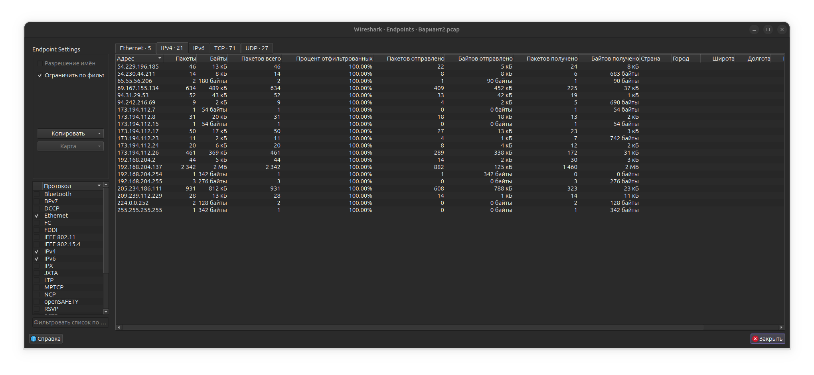
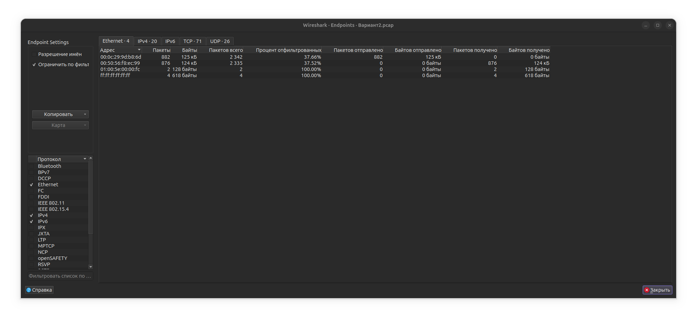
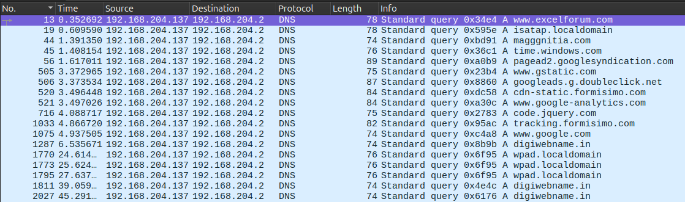
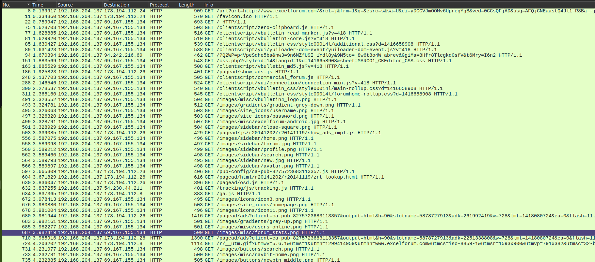
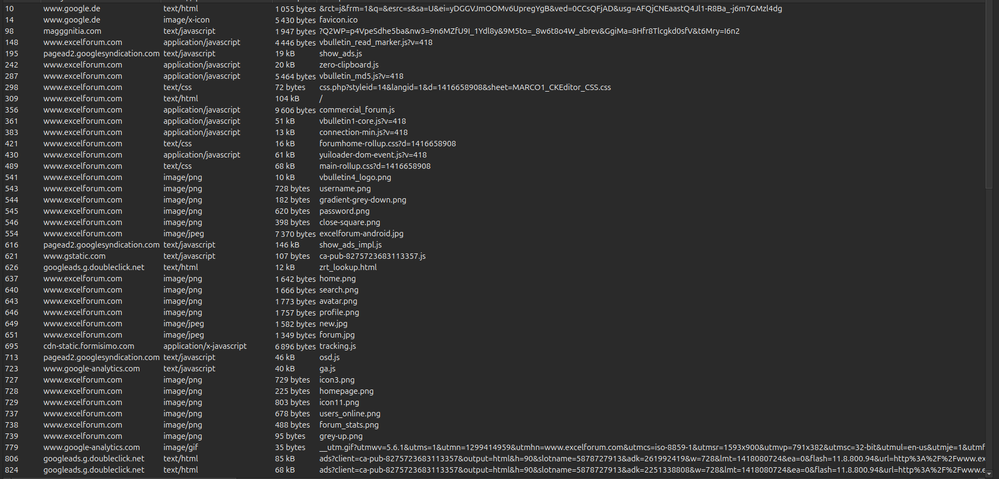

# Отчет: Анализ сетевого трафика и выявление скомпрометированного узла

**Студент:** [ФИО]
**Группа:** [Номер группы]
**Вариант:** 2
**Файл анализа:** `Вариант2.pcap`

---

## 1. Идентификация зараженного узла

### 1.1. Определение IP-адреса зараженного хоста

Для выявления наиболее активного узла в сети использована функция статистического анализа конечных точек.

**Действия:**
1. Открыт файл `Вариант2.pcap` в Wireshark
2. Выполнен переход: `Statistics → Endpoints`
3. Выбрана вкладка `IPv4`
4. Произведена сортировка по столбцу `Packets` (по убыванию)

**Скриншот:**



**Результаты анализа:**

| IP-адрес | Packets | Bytes | Tx Packets | Tx Bytes | Rx Packets | Rx Bytes |
|----------|---------|-------|------------|----------|------------|----------|
| 192.168.204.137 | 2342 | ... | 882 | ... | 1460 | ... |

**Вывод:** Наиболее активным узлом является хост с IP-адресом **192.168.204.137** (отправлено 882 пакета, получено 1460 пакетов).

---

### 1.2. Определение MAC-адреса зараженного хоста

**Действия:**
1. В окне `Statistics → Endpoints` выбрана вкладка `Ethernet`
2. Найдена запись с максимальным количеством пакетов

**Скриншот:**



**Результаты анализа:**

```
Address: 00:0c:29:9d:b8:6d
Packets: 2342
Bytes: ...
```

**Анализ OUI (Organizationally Unique Identifier):**
- Префикс `00:0c:29` принадлежит компании **VMware, Inc.**
- Это указывает на то, что зараженный узел является виртуальной машиной

**Вывод:** MAC-адрес зараженного узла — **00:0c:29:9d:b8:6d**

---

### 1.3. Определение доменного имени зараженного узла

Для извлечения NetBIOS-имени хоста использован протокол NBNS (NetBIOS Name Service).

**Действия:**
1. Применен фильтр отображения: `nbns`
2. Проанализированы NBNS Name Query пакеты

**Скриншот:**


**Результаты анализа пакетов NBNS:**

```
Protocol: NBNS
Info: Name query NB FHFAEBEECACACA<00>
Queries:
    FHFAEBEECACACA<00>: type NB, class IN
        Name: FHFAEBEECACACA<00> (Workstation/Redirector)
```

**Декодирование NetBIOS-имени:**
- Закодированное имя: `FHFAEBEECACACA`
- Тип записи: `<00>` (Workstation/Redirector)

**Вывод:** Доменное (NetBIOS) имя зараженного узла — **FHFAEBEECACACA**

---

## 2. Анализ DNS-трафика

### 2.1. Извлечение DNS-запросов от зараженного хоста

**Действия:**
1. Применен фильтр: `ip.src == 192.168.204.137 && dns`
2. Проанализированы все DNS-запросы

**Скриншот:**



**Результаты анализа:**

**Легитимные DNS-запросы:**
```
Standard query A www.excelforum.com
Standard query A www.google.de
Standard query A time.windows.com
Standard query A code.jquery.com
Standard query A www.gstatic.com
Standard query A pagead2.googlesyndication.com
Standard query A googleads.g.doubleclick.net
Standard query A www.google-analytics.com
Standard query A cdn-static.formisimo.com
Standard query A tracking.formisimo.com
```

**Системные DNS-запросы:**
```
Standard query A isatap.localdomain
Standard query A wpad.localdomain
```

**Подозрительные DNS-запросы:**
```
Standard query A magggnitia.com
Standard query A digiwebname.in
```

**Анализ подозрительных доменов:**
- `magggnitia.com` — домен с опечаткой (typosquatting), вероятно вредоносный
- `digiwebname.in` — домен в зоне .in, используется для доставки exploit kit

**Вывод:** Выявлены 2 подозрительных домена, являющихся индикаторами компрометации (IoC).

---

## 3. Анализ посещенных пользователем сайтов

### 3.1. Анализ HTTP-трафика

**Действия:**
1. Применен фильтр: `ip.src == 192.168.204.137 && http`
2. Изучены HTTP GET-запросы в хронологическом порядке

**Скриншот:**



**Первые HTTP-запросы в хронологии:**

**Пакет 1:**
```
GET /url?url=http://www.excelforum.com/&... HTTP/1.1
Host: www.google.de
User-Agent: Mozilla/4.0 (compatible; MSIE 8.0; Windows NT 6.1; ...)
```

**Пакет 2:**
```
GET / HTTP/1.1
Host: www.excelforum.com
Referer: http://www.google.de/url?url=http://www.excelforum.com/&...
User-Agent: Mozilla/4.0 (compatible; MSIE 8.0; Windows NT 6.1; ...)
```

**Анализ User-Agent:**
```
Mozilla/4.0 (compatible; MSIE 8.0; Windows NT 6.1; Trident/4.0; SLCC2; .NET CLR 2.0.50727; .NET CLR 3.5.30729; .NET CLR 3.0.30729)
```
- Браузер: **Internet Explorer 8**
- ОС: **Windows 7** (NT 6.1)
- Движок: Trident/4.0

**Вывод:** Пользователь сознательно посетил только 2 сайта:
1. **www.google.de** — поисковая система
2. **www.excelforum.com** — форум по Microsoft Excel (переход через Google)

---

### 3.2. Анализ запросов к excelforum.com

**Действия:**
1. Применен фильтр: `http.host == "www.excelforum.com"`

**Скриншот:**


**HTTP-запросы к excelforum.com:**

```
GET / HTTP/1.1
GET /clientscript/zero-clipboard.js HTTP/1.1
GET /clientscript/vbulletin_read_marker.js?v=418 HTTP/1.1
GET /clientscript/vbulletin-core.js?v=418 HTTP/1.1
```

**Анализ Referer первого запроса:**
```
Referer: http://www.google.de/url?url=http://www.excelforum.com/&rct=j&frm=1&q=&esrc=s&sa=U&ei=yDGGVJmOOMv6UpregYgB&ved=0CCsQFjAD&usg=AFQjCNEaastQ4Jl1-R8Ba_-j6m7GMzl4dg
```

**Вывод:** Переход на excelforum.com осуществлен через поисковую выдачу Google, что подтверждает легитимность намерений пользователя.

---

## 4. Выявление вредоносной активности

### 4.1. Запросы к магггnитia.com

**Действия:**
1. Применен фильтр: `http.host == "magggnitia.com"`

**Скриншот:**


**Детали HTTP-запроса:**

```
GET /?Q2WP=p4VpeSdhe5ba&nw3=9n6MZfU9I_1Ydl8y&9M5to=_8w6t8o4W_abrev&GgiMa=8Hfr8Tlcgkd0sfV&t6Mry=I6n2 HTTP/1.1
Host: magggnitia.com
Referer: http://www.excelforum.com/
Accept: image/jpeg, application/x-ms-application, image/gif, ...
User-Agent: Mozilla/4.0 (compatible; MSIE 8.0; ...)
```

**Анализ:**
- **IP-адрес сервера:** 94.242.216.69
- **Referer:** http://www.excelforum.com/ — перенаправление произошло с excelforum.com
- **GET-параметры:** обфусцированные параметры (Q2WP, nw3, 9M5to и др.)
- **Назначение:** gate-сервер для фильтрации и перенаправления трафика на exploit kit

**Вывод:** Сайт excelforum.com скомпрометирован и содержит код, перенаправляющий пользователей на вредоносный домен magggnitia.com.

---

### 4.2. Запросы к digiwebname.in

**Действия:**
1. Применен фильтр: `http.host == "digiwebname.in"`

**Скриншот:**


**Примеры HTTP-запросов:**

**Первый запрос:**
```
GET /6ktpi5xo/PoHWLGZwrjXeGDG3P-I5 HTTP/1.1
Host: digiwebname.in
Referer: http://www.excelforum.com/
```

**Последующие запросы:**
```
GET /6ktpi5xo/3830948c194842760701040b0b0f095a010b000b0d560858060c0b060a060a5a;118800;94 HTTP/1.1
GET /6ktpi5xo/4d0a65349d0e9f375d015c5a040e020d0657035a0257030f015008570507010d HTTP/1.1
GET /6ktpi5xo/7d0d7c94be7afa7a5b0d525f0558080d0557035f0301090f0250085204510b0d;910 HTTP/1.1
GET /6ktpi5xo/39e112e34c7d1c884055130a0309540a010a560a05505508060d5d070200570a;4060531 HTTP/1.1
GET /6ktpi5xo/656f20b469bc9ccd55455d5d000b530d0406055d0652520f03010e500102500d;6 HTTP/1.1
```

**Анализ:**
- **IP-адрес сервера:** 205.234.186.111
- **Базовый путь:** /6ktpi5xo/
- **URL-пути:** полностью обфусцированы (шестнадцатеричные последовательности)
- **Количество запросов:** 15+ различных URL
- **Referer:** http://www.excelforum.com/ или другие URL digiwebname.in
- **Назначение:** Exploit Kit — автоматическая эксплуатация уязвимостей браузера

**Вывод:** digiwebname.in является exploit kit'ом, который загружает различные эксплойты для проверки и использования уязвимостей системы.

---

## 5. Анализ загруженных файлов

### 5.1. Экспорт HTTP-объектов

**Действия:**
1. Выполнен переход: `File → Export Objects → HTTP...`
2. Проанализирован список всех загруженных файлов

**Скриншот:**



**Легитимные загруженные файлы:**

| Packet | Hostname | Content Type | Size | Filename |
|--------|----------|--------------|------|----------|
| ... | code.jquery.com | application/javascript | 51202 | jquery.min.js |
| ... | www.excelforum.com | application/javascript | 4446 | zero-clipboard.js |
| ... | www.excelforum.com | application/javascript | 20303 | vbulletin-core.js |
| ... | www.gstatic.com | application/javascript | 61619 | ... |
| ... | www.google-analytics.com | application/x-javascript | 6896 | ... |

**Подозрительные файлы с digiwebname.in:**

| Packet | Hostname | Content Type | Size | Filename |
|--------|----------|--------------|------|----------|
| ... | digiwebname.in | text/javascript; charset=UTF-8 | 7530 | f.txt |
| ... | digiwebname.in | text/javascript; charset=UTF-8 | 48401 | f.txt |
| ... | digiwebname.in | text/javascript; charset=UTF-8 | 18350 | f.txt |
| ... | digiwebname.in | text/javascript; charset=UTF-8 | 13594 | f.txt |

**Анализ подозрительных файлов:**
- **Имя файла:** f.txt (маскировка под текстовый файл)
- **Реальный тип:** text/javascript (JavaScript-код)
- **Размеры:** от 7 КБ до 48 КБ
- **Источник:** digiwebname.in (exploit kit)
- **Назначение:** Обфусцированный JavaScript для эксплуатации уязвимостей

**Вывод:** Пользователем и системой загружено 29 HTTP-объектов, из которых минимум 4 являются вредоносными JavaScript-файлами.

---

### 5.2. POST-запрос к C2-серверу

**Действия:**
1. Применен фильтр: `http.request.method == "POST" && ip.dst == 209.239.112.229`

**Скриншот:**


**Детали POST-запроса:**

```
POST / HTTP/1.1
Host: 209.239.112.229
Content-Length: ...
Content-Type: application/x-www-form-urlencoded
```

**Анализ:**
- **Метод:** POST (передача данных)
- **IP-адрес:** 209.239.112.229 (прямое обращение по IP, без DNS)
- **Назначение:** Command & Control сервер
- **Данные:** передача информации о зараженной системе

**Вывод:** Зафиксирована коммуникация с C2-сервером, что подтверждает успешное заражение системы.

---

## 6. Определение источника вредоносного ПО

### 6.1. Идентификация источника загрузки

**Анализ цепочки загрузки:**

1. **Первичный источник (TDS):** www.excelforum.com (69.167.155.134)
   - Скомпрометированный легитимный сайт
   - Содержит вредоносный код для перенаправления

2. **Gate-сервер:** magggnitia.com (94.242.216.69)
   - Фильтрация трафика (проверка User-Agent, GeoIP)
   - Перенаправление на exploit kit

3. **Exploit Kit:** digiwebname.in (205.234.186.111)
   - **Основной источник загрузки вредоносного ПО**
   - Доставка обфусцированных JavaScript-эксплойтов
   - Эксплуатация уязвимостей IE8

4. **C2-сервер:** 209.239.112.229
   - Прием данных от зараженной системы

**Ответ на вопрос:**
- **Доменное имя источника:** digiwebname.in
- **IP-адрес источника:** 205.234.186.111

---

## 7. Цепочка перенаправлений (Infection Chain)

### 7.1. Последовательность заражения

**Схема атаки:**

```
┌─────────────────┐
│ Пользователь    │
│ www.google.de   │ ← Легитимный поиск
└────────┬────────┘
         │ Клик по результату
         ↓
┌─────────────────────────┐
│ www.excelforum.com      │
│ IP: 69.167.155.134      │ ← Скомпрометированный сайт
│ Роль: TDS               │    (содержит вредоносный код)
└────────┬────────────────┘
         │ HTTP 302 / JavaScript redirect
         ↓
┌─────────────────────────┐
│ magggnitia.com          │
│ IP: 94.242.216.69       │ ← Gate-сервер
│ Роль: Traffic Filter    │    (фильтрация жертв)
└────────┬────────────────┘
         │ Перенаправление подходящих жертв
         ↓
┌─────────────────────────┐
│ digiwebname.in          │
│ IP: 205.234.186.111     │ ← Exploit Kit
│ Роль: Exploitation      │    (эксплуатация уязвимостей)
└────────┬────────────────┘
         │ Загрузка и выполнение payload
         ↓
┌─────────────────────────┐
│ 209.239.112.229         │
│ Роль: C2 Server         │ ← Command & Control
└─────────────────────────┘    (управление зараженной системой)
```

---

### 7.2. Механизмы перенаправлений

**Анализ HTTP Stream:**

**Действия:**
1. Выбран пакет с запросом к magggnitia.com
2. Выполнено: ПКМ → Follow → HTTP Stream

**Скриншот:**


**HTTP-диалог:**

```
GET /?Q2WP=p4VpeSdhe5ba&nw3=9n6MZfU9I_1Ydl8y&9M5to=_8w6t8o4W_abrev&GgiMa=8Hfr8Tlcgkd0sfV&t6Mry=I6n2 HTTP/1.1
Host: magggnitia.com
Referer: http://www.excelforum.com/
User-Agent: Mozilla/4.0 (compatible; MSIE 8.0; Windows NT 6.1; ...)
Accept: image/jpeg, application/x-ms-application, ...
Accept-Language: en-US
Accept-Encoding: gzip, deflate
Connection: Keep-Alive

HTTP/1.1 200 OK
Server: nginx
Content-Type: text/html; charset=UTF-8
...
```

**Используемые техники перенаправления:**

1. **excelforum.com → magggnitia.com:**
   - Вредоносный JavaScript на странице excelforum.com
   - Возможные методы: `document.location`, скрытый `<iframe>`, `window.open()`

2. **magggnitia.com → digiwebname.in:**
   - HTTP 302 редирект (условный, на основе фильтрации)
   - Или JavaScript: `window.location.href = "http://digiwebname.in/..."`

3. **digiwebname.in → множественные запросы:**
   - Автоматические AJAX-запросы
   - Динамическая загрузка `<script>` тегов
   - Drive-by download (загрузка без взаимодействия пользователя)

---

### 7.3. Временная последовательность

**Статистика TCP-соединений:**

**Действия:**
1. Выполнен переход: `Statistics → Conversations`
2. Выбрана вкладка `TCP`
3. Применена сортировка по времени

**Скриншот:**


**Ключевые TCP-соединения:**

| Address A | Port A | Address B | Port B | Packets | Start Time |
|-----------|--------|-----------|--------|---------|------------|
| 192.168.204.137 | ... | 173.194.112.24 | 80 | ... | 0.000 |
| 192.168.204.137 | ... | 69.167.155.134 | 80 | ... | ... |
| 192.168.204.137 | ... | 94.242.216.69 | 80 | ... | ... |
| 192.168.204.137 | ... | 205.234.186.111 | 80 | ... | ... |
| 192.168.204.137 | ... | 209.239.112.229 | 80 | ... | ... |

**Соответствие IP-адресов доменам:**
- 173.194.112.24 → www.google.de
- 69.167.155.134 → www.excelforum.com
- 94.242.216.69 → magggnitia.com
- 205.234.186.111 → digiwebname.in
- 209.239.112.229 → C2-сервер (без DNS)

---

## 8. Сводка индикаторов компрометации (IoC)

### 8.1. Вредоносные домены и IP-адреса

| Домен | IP-адрес | Роль | Статус |
|-------|----------|------|--------|
| www.excelforum.com | 69.167.155.134 | Скомпрометированный сайт (TDS) | Вредоносный |
| magggnitia.com | 94.242.216.69 | Gate / Traffic Filter | Вредоносный |
| digiwebname.in | 205.234.186.111 | Exploit Kit | Вредоносный |
| 209.239.112.229 | 209.239.112.229 | C2 Server | Вредоносный |

### 8.2. Вредоносные файлы

| Имя файла | Тип | Размер | Источник | Назначение |
|-----------|-----|--------|----------|------------|
| f.txt | text/javascript | 7530 | digiwebname.in | JavaScript exploit |
| f.txt | text/javascript | 48401 | digiwebname.in | JavaScript exploit |
| f.txt | text/javascript | 18350 | digiwebname.in | JavaScript exploit |
| f.txt | text/javascript | 13594 | digiwebname.in | JavaScript exploit |

### 8.3. Эксплуатируемые уязвимости

- **Браузер:** Internet Explorer 8 (устаревшая версия)
- **ОС:** Windows 7
- **Вероятные CVE:**
  - Уязвимости в IE8 (memory corruption, use-after-free)
  - Уязвимости в Flash Player
  - Уязвимости в Java

---

## 9. Итоговые выводы

### 9.1. Параметры зараженного узла

| Параметр | Значение |
|----------|----------|
| **IP-адрес** | 192.168.204.137 |
| **MAC-адрес** | 00:0c:29:9d:b8:6d |
| **NetBIOS-имя** | FHFAEBEECACACA |
| **Тип хоста** | VMware виртуальная машина |
| **ОС** | Windows 7 (NT 6.1) |
| **Браузер** | Internet Explorer 8 |

### 9.2. Сценарий атаки

1. **Вектор заражения:** Drive-by download через скомпрометированный веб-сайт
2. **Начальная точка:** Пользователь через Google перешел на www.excelforum.com
3. **Перенаправление:** Вредоносный код на excelforum.com перенаправил на magggnitia.com
4. **Фильтрация:** magggnitia.com проверил параметры жертвы и перенаправил на exploit kit
5. **Эксплуатация:** digiwebname.in использовал уязвимости IE8 для загрузки вредоносного ПО
6. **Установка:** Вредоносное ПО установлено и установлена связь с C2-сервером 209.239.112.229
7. **Результат:** Система скомпрометирована

### 9.3. Ответы на поставленные вопросы

1. **IP-адрес зараженного узла:** 192.168.204.137
2. **MAC-адрес зараженного узла:** 00:0c:29:9d:b8:6d
3. **Доменное имя зараженного узла:** FHFAEBEECACACA
4. **Сайты, посещенные пользователем:** www.google.de, www.excelforum.com
5. **Все сайты в трафике:** www.google.de, www.excelforum.com, magggnitia.com, digiwebname.in, Google-сервисы (аналитика, реклама), code.jquery.com и др.
6. **Источник загрузки вредоносного ПО (домен):** digiwebname.in
7. **Источник загрузки вредоносного ПО (IP):** 205.234.186.111
8. **Легитимные файлы загружены:** Да (jQuery, vBulletin скрипты, Google Analytics, CSS, изображения)
9. **Вредоносные домены:** www.excelforum.com (скомпрометирован), magggnitia.com, digiwebname.in, 209.239.112.229
10. **Механизм перенаправлений:** JavaScript redirects, HTTP 302, скрытые iframe, автоматическая загрузка через `<script>` теги

### 9.4. Рекомендации по реагированию

**Немедленные действия:**
1. Изолировать хост 192.168.204.137 от сети
2. Выполнить полное сканирование антивирусом с актуальными базами
3. Проверить автозагрузку, службы, запланированные задачи
4. Провести анализ оперативной памяти на наличие вредоносных процессов
5. Проверить файловую систему на подозрительные файлы

**Превентивные меры:**
1. Обновить браузеры до актуальных версий (отказ от IE8)
2. Установить обновления безопасности Windows
3. Внедрить веб-фильтрацию с блокировкой вредоносных доменов
4. Настроить IDS/IPS для обнаружения exploit kit активности
5. Провести обучение сотрудников основам информационной безопасности

**Мониторинг сети:**
1. Блокировать доступ к IP: 94.242.216.69, 205.234.186.111, 209.239.112.229
2. Мониторить DNS-запросы к доменам: magggnitia.com, digiwebname.in
3. Отслеживать POST-запросы к неизвестным IP-адресам
4. Анализировать загрузку файлов с расширением .txt, но типом text/javascript

---

**Дата выполнения:** [Дата]
**Подпись:** ______________
